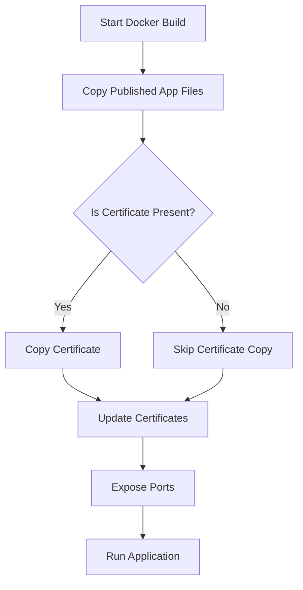

# 🔒 Securing API Communication over SSL in Docker | ایمن‌سازی ارتباط API با SSL در داکر

> این راهنما به صورت کامل نحوه اضافه کردن گواهی SSL در پروژه‌های داکریزه شده را توضیح می‌دهد تا ارتباطی ایمن بین API و Client برقرار شود.
>
> This comprehensive guide explains how to install an SSL certificate inside Docker projects to establish secure API-to-Client communication.

---

## 📂 Project Structure | ساختار پروژه

```text
ProjectRoot/
├── PublishedApp/          # خروجی منتشر شده‌ی پروژه (مثلاً خروجی dotnet publish)
├── Dockerfile             # فایل داکر جهت ساخت ایمیج
├── root-certificate.pem   # فایل گواهی SSL (اختیاری)
└── README.md              # فایل مستندات پروژه
```

> **توضیح:** فایل‌های `Dockerfile` و `root-certificate.pem` باید کنار خروجی پروژه قرار بگیرند تا به درستی در مرحله build در داکر قرار داده شوند.
>
> **Note:** The `Dockerfile` and `root-certificate.pem` must be placed alongside the published output to be properly copied during Docker build.

---

## ✨ Steps to Add SSL Certificate in Docker | مراحل اضافه کردن SSL در داکر

### ✅ 1. Prepare the Certificate | آماده سازی گواهی

- گواهی ریشه SSL خود را تهیه کنید. فرمت باید `.pem` یا `.crt` باشد.
- فایل را در کنار Dockerfile قرار دهید.

- Obtain your SSL root certificate (`.pem` or `.crt`).
- Place the file next to your Dockerfile.

### ✅ 2. Update the Dockerfile | بروزرسانی Dockerfile

```dockerfile
FROM mcr.microsoft.com/dotnet/aspnet:8.0

WORKDIR /app

# Copy application files
COPY PublishedApp/ .

# Copy SSL certificate (if exists)
COPY root-certificate.pem /usr/local/share/ca-certificates/root-certificate.crt

# Update system certificates
RUN update-ca-certificates || true

EXPOSE 80
EXPOSE 443

# Run the application
ENTRYPOINT ["dotnet", "YourApp.dll"]
```

> **نکته:** استفاده از `|| true` باعث می‌شود اگر فایل گواهی موجود نباشد، عملیات build متوقف نشود.
>
> **Tip:** Using `|| true` ensures the build does not fail if the certificate is missing.

---

## 📈 Process Flow Diagram | نمودار جریان فرآیند



> **نمودار بالا:** فرآیند نصب گواهی در داکر را به صورت ساده نمایش می‌دهد.
>
> **The diagram above:** Illustrates the process of SSL certificate installation in Docker builds.

---

## ⚙️ Build and Run | ساخت و اجرای کانتینر

### 🔵 Build the Docker image | ساخت ایمیج داکر

```bash
docker build -t yourprojectname:latest .
```

### 🔵 Run the container | اجرای کانتینر

```bash
docker run -d -p 8080:80 --name yourprojectname yourprojectname:latest
```

### 🌐 Access your API | دسترسی به API

```text
http://localhost:8080
```

> **نکته:** برای دسترسی امن، پیشنهاد می‌شود از HTTPS نیز استفاده شود.
>
> **Tip:** For secure access, it is recommended to configure HTTPS.

---

## 🛡️ Why Install SSL Certificate? | چرا باید SSL نصب کنیم؟

- جلوگیری از بروز خطاهای SSL/TLS هنگام فراخوانی سرویس‌های خارجی
- برقراری ارتباط امن HTTPS بین سرور و کلاینت
- ضروری برای محیط‌هایی که از گواهی‌های Self-Signed استفاده می‌کنند

- Prevent SSL/TLS handshake errors when calling external services
- Establish secure HTTPS communication between server and client
- Essential when using self-signed certificates in private networks

---

## 📜 Requirements | پیش‌نیازها

- نصب بودن Docker روی سیستم
- در دست داشتن خروجی `publish` شده‌ی پروژه (مثلاً دات‌نت)
- فایل گواهی SSL (در صورت نیاز)

- Docker installed on your system
- Published output of your project (e.g., .NET application)
- SSL certificate file (optional)

---

## ✍️ Author | نویسنده

- [Ali Darehshori](https://github.com/ali80da)

---

> همواره از SSL برای محافظت از ارتباطات API خود استفاده کنید تا از افشای اطلاعات جلوگیری شود.
>
> Always use SSL to protect your API communications and prevent information leakage.

---
